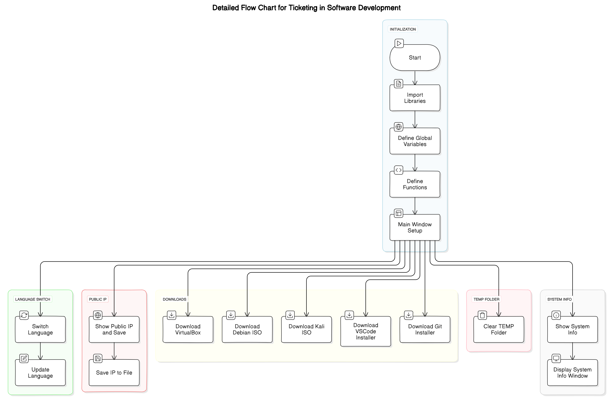

# Multi-functional App

This application has several different features, such as saving a public IP address, downloading VirtualBox, Debian and Kali Linux ISO, downloading Visual Studio Code and Git installers, deleting a TEMP folder, and displaying system information.

## Features

- **Save public IP address and ID**: Retrieves and saves the public IP address and unique identifier in a file.
- **Download VirtualBox**: Downloads the VirtualBox Windows installer.
- **Download Debian ISO**: Downloads the Debian ISO file.
- **Download Kali Linux ISO**: Downloads the Kali Linux ISO file.
- **Download Visual Studio Code**: Downloads the Visual Studio Code installer.
- **Download Git**: Downloads the Git installer.
- **Delete TEMP folder**: Deletes the contents of the TEMP folder.
- **Show System Information**: Displays system information in a separate window.

## Install and run

1. Make sure Python and the required packages are installed on your machine.
2. Download the repo using the 'git clone' command:

```bash
git clone https://github.com/zuhi535/MultiLang-System-Utility-app.git
```
3. Navigate to the project directory:
```bash
cd MultiLang-System-Utility-app
```
4. Install the required Python packages:
```bash
pip install -r requirements.txt
```
5. Run the application:
```bash
python app.py
```
> [!IMPORTANT]
> Before running, make sure that all necessary libraries are installed
# Usage 

## Change language 

***The application supports English, Hungarian, German and Russian languages. Select the desired language from the drop-down menu.***

## Save public IP address 
***Click the "Save Public IP and Identifier" button to save the public IP address and identifier.***

## Downloads
***-VirtualBox: Click the "Download VirtualBox (Windows)" button.***

***-Debian ISO: Click the "Download Debian (ISO)" button..***

***-Kali Linux ISO: Click the "Download Kali Linux (ISO)" button.***

***-Visual Studio Code: Click the " Download Visual Studio Code" button. .***

***-Git: Click the "Download Git" button.***

## Clear TEMP Folder 
***Click the "Clear TEMP Folder" button to clear the contents of the TEMP folder.***

## Show System Information 
***Click the "Show System Information" button to view the system information.***

## System Requirements
1. Python 3.6 or higher 
2. Internet connection for downloads


# Multi-functional App. Stepwise


<p align="center">
  
</p>
